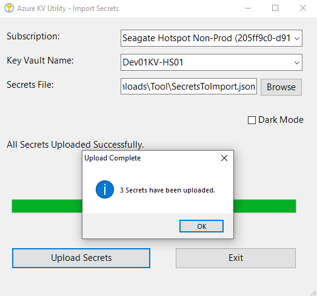

# 🔐 Azure Key Vault Secrets - JSON Import/Export Utility

  

A user-friendly tool to bulk import/export secrets between Azure Key Vault and JSON files.  
Developed by **Ajinkya Bapat** ([📧 ajinkyabapat12@gmail.com](mailto:ajinkyabapat12@gmail.com)).

---

## 📋 Table of Contents
1. [Problem Statement](#-problem-statement)
2. [Features](#-features)
3. [Software Requirements](#-software-requirements)
4. [Language & Frameworks Used](#-language--frameworks-used)
5. [Export Secrets Guide](#-export-secrets-guide)
6. [Import Secrets Guide](#-import-secrets-guide)
7. [Feedback](#-feedback)
8. [Disclaimer](#️-disclaimer)

---

## 🧩 Problem Statement
Azure Key Vault securely stores sensitive data like API keys, passwords, and certificates. It is widely used by developers and
organizations to safeguard secrets used by their applications and services. However, Azure CLI lacks native support for **bulk import/export of secrets in JSON format**. Manually handling large numbers of secrets is time-consuming and error-prone. This tool addresses that gap by enabling seamless JSON-based bulk operations.

---

## 🚀 Features
- **📤 Export Secrets**: Save all secrets from a Key Vault into a JSON file.
- **📥 Import Secrets**: Upload secrets from a JSON file to a Key Vault.
- **🖥️ GUI Interface**: Intuitive Windows Forms interface (no PowerShell expertise needed).
- **🔑 Azure Login Checks**: Auto-detects Azure login status and supports User/Service Principal authentication.
- **🌙 Dark Mode**: Reduce eye strain during late-night coding sessions.
- **📦 Standalone Executable**: Packaged as a Windows `.exe` using `ps2exe`.

---

## 💻 Software Requirements
- **Windows OS**: The tool runs on Windows.
- **Azure CLI**: Required for Azure interactions.  
  [Installation Guide ↗](https://learn.microsoft.com/en-us/cli/azure/install-azure-cli)

---

## 🛠️ Language & Frameworks Used
- **PowerShell**: Core scripting language.
- **Windows Forms (.NET)**: GUI development.
- **Azure CLI**: Key Vault operations.
- **System.Drawing**: UI styling and graphics.

---

## 📤 Export Secrets Guide
1. **🔑 Check Azure Login**:  
   The tool verifies your Azure login status. If not logged in, choose:
   - **👤 User Account**: Interactive browser login.
   - **🔧 Service Principal**: Provide Client ID, Secret, and Tenant ID.
   
2. **📝 Select Subscription & Key Vault**:  
   Choose a subscription and Key Vault from dropdowns.
   
3. **💾 Export to JSON**:  
   Specify a filename (e.g., `ExportedSecrets.json`) and click **Start Export**.  
   <!-- 

     
   
 -->

---

## 📥 Import Secrets Guide
1. **🔑 Check Azure Login**:  
   Follow the same login steps as in [Export Secrets](#-export-secrets-guide).
   
2. **📝 Select Subscription & Key Vault**:  
   Choose the target Key Vault.
   
3. **📄 Upload JSON File**:  
   Browse and select a valid JSON secrets file. Click **Upload Secrets**.  
   <!-- 

     
   
 -->

---

## 📬 Feedback
Your feedback is invaluable! 
 For suggestions, issues, or feature requests, contact: 📧 [ajinkyabapat12@gmail.com](mailto:ajinkyabapat12@gmail.com)

---

## ⚠️ Disclaimer
**This tool does NOT store or persist any data, credentials, or secrets.**  
- It acts solely as a graphical interface to execute Azure CLI commands for Key Vault operations.  
- All secret data remains within your Azure Key Vault or local JSON files during operations.  
- Users are responsible for:  
  - Securing Azure credentials used for authentication  
  - Protecting JSON files containing secrets  
  - Managing access to the executable tool  

*Always use this tool in secure environments and follow Azure security best practices.*  

---

   
  <em>Developed with ❤️ by Ajinkya Bapat. Last updated: January 22, 2025.</em>

